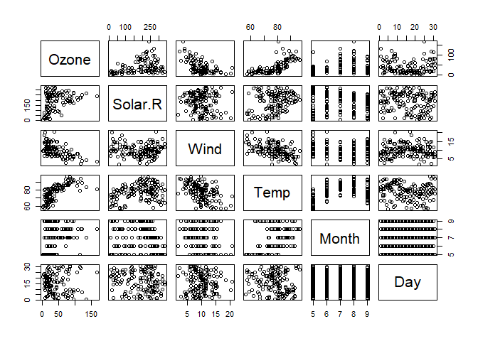

Programming Background
================
Shaniqua A. Walker
9/14/2021

``` r
library(usethis)
library(tidyverse)
use_git_config(user.name = "ShaniquaWalker", user.email = "sawalke4@ncsu.edu")
rmarkdown::render("2021-9-14-Second-Blog-Post.Rmd", 
                  output_format = "github_document", 
                  output_dir = "../_posts/")
#git config --global user.email "sawalke4@ncsu.edu"
#git config --global user.name "Shaniqua Walker"
```

## My Experience With Programming

### R vs. SAS

When it comes to R, I enjoy the language way more than SAS. I’m not sure
how I can explain it better but I believe that the R language is more
straightforward and easier to understand, unlike SAS.

The functionality I like about R is the way it is a glorified calculator
while also being a service that allows the user to create various types
of documents that show many different ways of showing data.

I honestly do not miss much about SAS.

I would say R language is medium as far as difficulty to learn. My first
experience with R was in 563 and, although there was a book that helped
me understand some basic functions and setups that R can pull off, this
course has increased the little things that I did not catch on to
quickly.

``` r
plot(airquality)
```

<!-- -->
